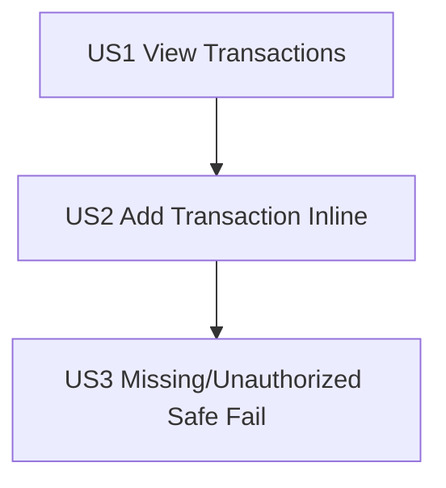

# Tasks: Account Transactions

**Input**: Design documents from `specs/001-account-transactions/`

## Constitution Hooks *(do not remove)*

- Every task references the spec ID and scenario it satisfies (Principle I).
- Database tasks cite the migration file and describe how determinism is enforced (Principle II).
- Tasks that add a dependency must link to the plan’s approved justification; default assumption is “no new dependency” (Principle III).
- UI/tasks touching templates or CSS include a step to confirm the Tailwind watcher is running and document HTMX targets (Principle IV).
- AI-generated tasks/changes store prompt/response location noted in task descriptions (Principle V).

---

## Phase 1: Setup (Shared Infrastructure)

- [X] T001 Confirm Tailwind watcher command (`npm run dev:css`) and record terminal output in docs/ai/002-account-transactions-log.md (Spec UI-005, Principle IV)
- [X] T002 Run baseline test command and record results in docs/ai/002-account-transactions-log.md (Spec SC-003 baseline, Principle II)

---

## Phase 2: Foundational (Blocking Prerequisites)

- [X] T003 Add `Transaction` model + `TransactionDirection` TextChoices + deterministic queryset helper in financial/models.py (Spec FR-001, FR-004)
- [X] T004 [P] Create migration financial/migrations/0002_transaction.py adding the Transaction table + composite index `(account_id, posted_on, created_at, id)` with clean rollback (Spec Deterministic Data & Integrity)
- [X] T005 [P] Add `TransactionForm` (ModelForm) with widgets + positive amount validation in financial/forms.py (Spec FR-003)
- [X] T006 [P] Implement transaction row serializer + signed amount display helper in financial/services/transactions.py (Spec Display rules + FR-004)

**Checkpoint**: Migration applies cleanly and core model/form/service compile.

---

## Phase 3: User Story 1 — View Transactions on Account (Priority: P1) 🎯 MVP

**Goal**: Render a Transactions panel on the account detail page for empty and non-empty accounts.

**Independent Test**: Visit `/accounts/<uuid>/` and confirm Transactions panel renders empty state and table state deterministically.

### Tests (write first; ensure they fail before implementation)

- [X] T007 [US1] Update financial/tests/test_accounts_detail.py to assert the new Transactions panel renders (remove “Transactions (Coming Soon)” expectation) (US1 scenario 1/2)
- [X] T008 [US1] Add view/render tests for empty and non-empty transactions panel in financial/tests/test_account_transactions_panel.py (US1 scenarios 1/2, FR-004)

### Implementation

- [X] T009 [P] [US1] Create reusable transactions table component in templates/components/financial/account_transactions_table.html (Spec FR-008)
- [X] T010 [P] [US1] Create transactions body fragment template financial/templates/financial/accounts/transactions/_body.html using stable swap target `#account-transactions-body` (Spec UI-001)
- [X] T011 [P] [US1] Create inline “not found” fragment template financial/templates/financial/accounts/transactions/_missing.html (US3 scenario 1 groundwork)
- [X] T012 [US1] Implement GET fragment view for `/accounts/<uuid:pk>/transactions/` in financial/views.py (auth + ownership; deterministic ordering; returns `_missing.html` with HTTP 200 on missing/unowned) (FR-002, FR-004)
- [X] T013 [US1] Add URL route for transactions body in financial/urls.py (`<uuid:pk>/transactions/`) (FR-005)
- [X] T014 [US1] Replace the placeholder card with a stable Transactions panel container in financial/templates/financial/accounts/detail.html (`#account-transactions` + `#account-transactions-body`) (UI-001, UI-003)
- [X] T015 [US1] Extend AccountDetailView context in financial/views.py to render initial Transactions body server-side (no HTMX required for first paint) (US1 scenarios 1/2)

**Checkpoint**: US1 works without US2 endpoints.

---

## Phase 4: User Story 2 — Add Transaction Inline (Priority: P1)

**Goal**: Add Transaction form swaps into the panel body; Save creates and returns updated table; Cancel restores table.

**Independent Test**: On account detail: Add → form shows; Save valid → row appears; Save invalid → 422 + errors; Cancel → table returns.

### Tests (write first; ensure they fail before implementation)

- [X] T016 [US2] Add HTMX add-flow tests in financial/tests/test_account_transactions_add.py for GET new form, POST valid, POST invalid (422), and Cancel path (US2 scenarios 1–4, FR-007)

### Implementation

- [X] T017 [P] [US2] Create add form fragment financial/templates/financial/accounts/transactions/_form.html with `direction` radios + `posted_on` date input default and `hx-post`/Cancel wiring per spec (UI-002)
- [X] T018 [US2] Implement GET `/accounts/<uuid:pk>/transactions/new/` in financial/views.py returning `_form.html` or `_missing.html` (US2 scenario 1)
- [X] T019 [US2] Implement POST `/accounts/<uuid:pk>/transactions/new/` in financial/views.py: on valid save return `_body.html`; on invalid return `_form.html` with HTTP 422 (US2 scenarios 3/4, FR-006, FR-007)
- [X] T020 [US2] Add URL routes for transactions new GET/POST in financial/urls.py (`<uuid:pk>/transactions/new/`) (FR-005)
- [X] T021 [US2] Add stable panel header button wiring in financial/templates/financial/accounts/detail.html: Add button `hx-get` targets `#account-transactions-body` and uses `hx-request="queue:last"` + `hx-disabled-elt="this"` (UI-002, UI-003)

**Checkpoint**: US2 works end-to-end and does not remove the Add button from the DOM.

---

## Phase 5: User Story 3 — Handle Missing/Unauthorized Account (Priority: P2)

**Goal**: Transactions fragments fail safely for missing/unowned accounts without leaking data.

**Independent Test**: Request each transactions endpoint for missing/unowned account and see inline message within the panel body.

### Tests (write first; ensure they fail before implementation)

- [X] T022 [US3] Add missing/unowned endpoint tests in financial/tests/test_account_transactions_missing.py for `/transactions/` and `/transactions/new/` GET/POST (US3 scenario 1)

### Implementation

- [X] T023 [US3] Ensure all transactions endpoints share a single missing/unowned handling path in financial/views.py that returns `_missing.html` with HTTP 200 and no data (Spec Endpoints + US3 scenario 1)

**Checkpoint**: US3 behavior is consistent across all fragments.

---

## Phase 6: Polish & Cross-Cutting Concerns

- [X] T024 [P] Reconcile implemented URL param naming and behavior notes in specs/001-account-transactions/contracts/transactions.yaml (ensure it matches Django routes and status codes)
- [X] T025 Update specs/001-account-transactions/quickstart.md if any command or URL differs from implementation
- [X] T026 [P] Add a performance sanity test for rendering ~200 transactions in financial/tests/test_account_transactions_performance.py (Spec SC-004)
- [X] T027 Record full test run output in docs/ai/002-account-transactions-log.md (Spec SC-003, SC-004, Principle II)
- [X] T028 Record migration check output (e.g., `python manage.py makemigrations --check`) in docs/ai/002-account-transactions-log.md (Spec Schema Changes, Principle II)
- [X] T029 Verify success criteria evidence and record in docs/ai/002-account-transactions-log.md: SC-001 (manual timed add flow) and SC-002 (422 + inline errors without leaving account detail) (Spec SC-001, SC-002, US2 scenarios 3/4)

---

## Dependencies & Execution Order

### Phase Dependencies

- Phase 1 (Setup) → Phase 2 (Foundational) → Phase 3 (US1) → Phase 4 (US2) → Phase 5 (US3) → Phase 6 (Polish)

### User Story Dependencies

- US1 is the MVP foundation (panel/table rendering).
- US2 depends on US1 because successful create returns the US1 body fragment.
- US3 depends on US1/US2 endpoints existing so their failure behavior can be verified consistently.

Dependency graph (user story completion order):

### Parallel Opportunities

- After T003, tasks T004/T005/T006 can be done in parallel.
- Template-only tasks within US1/US2 (T009–T011, T017) can be done in parallel.
- Contracts/perf tasks in Polish (T024, T026) can be done in parallel.

---

## Parallel Execution Examples

### US1

- Implement templates in parallel:
  - `templates/components/financial/account_transactions_table.html` (T009)
  - `financial/templates/financial/accounts/transactions/_body.html` (T010)
  - `financial/templates/financial/accounts/transactions/_missing.html` (T011)

### US2

- While views/urls are being implemented, build the form fragment in parallel:
  - `financial/templates/financial/accounts/transactions/_form.html` (T017)

### US3

- While endpoint behavior is being finalized, write the missing/unowned tests in parallel:
  - `financial/tests/test_account_transactions_missing.py` (T022)

---

## Implementation Strategy

### MVP First (US1)

1. Complete T001–T006
2. Complete T007–T015
3. Validate US1 independently (spec acceptance scenarios)

### Incremental Delivery

- Add US2 (T016–T021), validate add flow
- Add US3 (T022–T023), validate safe failure
- Finish polish (T024–T028)
- Finish polish (T024–T029)

---

## Format Validation

- All tasks follow `- [ ] T### [P?] [US?] Description with file path` format.
