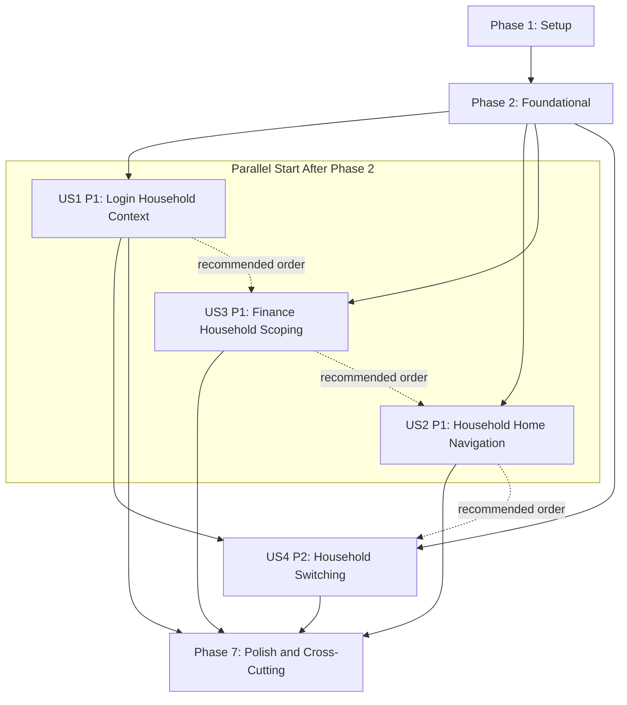
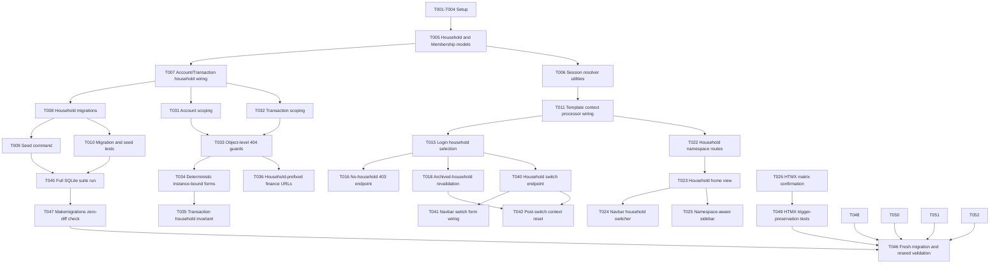

# Tasks: Household Top-Level Container (MVP)

**Input**: Design documents from `/specs/001-add-household-container/`
**Prerequisites**: plan.md (required), spec.md (required for user stories), research.md, data-model.md, contracts/

**Tests**: Included because spec requires automated SQLite test execution and behavior verification (`FR-015`, acceptance scenarios).

**Organization**: Tasks are grouped by user story to enable independent implementation and testing of each story.

## Constitution Hooks *(do not remove)*

- Every task references the spec ID and scenario it satisfies (Principle I).
- Database tasks MUST cite the migration/fixture file and describe how determinism is enforced (Principle II).
- Tasks that add a dependency must link to the plan’s approved justification; default assumption is “no new dependency” (Principle III).
- UI/tasks touching templates or CSS must include a subtask to confirm the Tailwind watcher is running and to document HTMX targets (Principle IV).
- Tasks generated or implemented with AI must store the prompt/response location noted in the task description (Principle V).

## Phase 1: Setup (Shared Infrastructure)

**Purpose**: Establish baseline artifacts and execution environment for deterministic household work.

- [ ] T001 Document no-new-dependency decision from plan in specs/001-add-household-container/research.md and README.md
- [ ] T002 Create AI prompt/response log scaffold in docs/ai/003-household-top-level-container-log.md
- [ ] T003 [P] Verify and record Tailwind watcher command evidence (`npm run dev:css`) in docs/ai/003-household-top-level-container-log.md
- [ ] T004 [P] Add feature route map notes for `/household/` and `/household/finance/` in specs/001-add-household-container/quickstart.md

---

## Phase 2: Foundational (Blocking Prerequisites)

**Purpose**: Core schema and tenancy primitives required before user story work.

**⚠️ CRITICAL**: No user story work can begin until this phase is complete.

- [ ] T005 Create `Household` and `HouseholdMember` models with constraints in financial/models.py
- [ ] T006 [P] Add household session resolver utilities (select primary/first/fallback non-archived) in financial/services/households.py
- [ ] T007 Add household FK and invariant wiring for `Account` and `Transaction` in financial/models.py
- [ ] T008 Create migrations for household entities and financial FK updates in financial/migrations/0005_household.py and financial/migrations/0006_financial_household_scope.py
- [ ] T009 [P] Implement deterministic seed command for two canonical households in financial/management/commands/seed_households.py
- [ ] T010 [P] Add migration + seed repeatability tests under SQLite in financial/tests/test_migrations_backfill.py and financial/tests/test_household_seed.py
- [ ] T011 Add `current_household` template context processor wiring (no middleware in this task) in core/settings.py and core/settings_test.py

**Checkpoint**: Foundation ready — user story implementation can now begin.

---

## Phase 3: User Story 1 - Enter household-scoped workspace after login (Priority: P1) 🎯 MVP

**Goal**: Set deterministic `current_household` on login and guard zero-household/archived household scenarios.

**Independent Test**: Login with single-membership, multi-membership (primary/non-primary), and zero-membership users; verify redirects/status codes and session key behavior.

### Tests for User Story 1

- [ ] T012 [P] [US1] Add login household-selection tests for single/primary/fallback flows in financial/tests/test_household_login_selection.py
- [ ] T013 [P] [US1] Add no-household-access 403 page and navigation omission test in financial/tests/test_household_no_access.py
- [ ] T014 [P] [US1] Add archived-current-household fallback and 403 fallback tests in financial/tests/test_household_archived_fallback.py

### Implementation for User Story 1

- [ ] T015 [US1] Implement post-login household selection and redirect to `/household/` in core/urls.py and financial/views.py
- [ ] T016 [US1] Implement no-household-access endpoint/template with HTTP 403 in pages/views.py and templates/pages/no_household_access.html
- [ ] T017 [US1] Enforce single primary membership per user and owner-preservation validation in financial/models.py
- [ ] T018 [US1] Wire archived-household revalidation on household-scoped requests in financial/services/households.py and financial/views.py

**Checkpoint**: User Story 1 is independently functional and testable.

---

## Phase 4: User Story 2 - Navigate modules from household home (Priority: P1)

**Goal**: Provide stable household launcher and module navigation to finance under household routes.

**Independent Test**: Load `/household/`, verify module launcher renders, and navigate to `/household/finance/` through normal route navigation.

### Tests for User Story 2

- [ ] T019 [P] [US2] Add household home launcher rendering test in financial/tests/test_household_home.py
- [ ] T020 [P] [US2] Add household finance root route/navigation test in financial/tests/test_household_finance_routing.py
- [ ] T021 [P] [US2] Add namespace-driven sidebar menu rendering test in financial/tests/test_household_navigation_menus.py

### Implementation for User Story 2

- [ ] T022 [US2] Add `household` namespace routes for home, switch, and finance root in core/urls.py and pages/urls.py
- [ ] T023 [US2] Implement household home view and module launcher template in pages/views.py and templates/pages/household_home.html
- [ ] T024 [US2] Update global navbar to include household switcher and `/household/` title link in templates/components/layout/navbar.html
- [ ] T025 [US2] Implement namespace-aware sidebar menu branching in templates/components/layout/sidebar.html
- [ ] T026 [US2] Record HTMX target/swap/root/container matrix confirmation for touched finance endpoints in specs/001-add-household-container/plan.md

**Checkpoint**: User Story 2 is independently functional and testable.

---

## Phase 5: User Story 3 - Use finance data within active household only (Priority: P1)

**Goal**: Enforce strict household scoping for all finance list/detail/mutation flows.

**Independent Test**: Seed two households with distinct financial data; verify only active household data is visible and outside-scope object access returns 404.

### Tests for User Story 3

- [ ] T027 [P] [US3] Add household-scoped accounts list/detail isolation tests in financial/tests/test_household_accounts_scope.py
- [ ] T028 [P] [US3] Add household-scoped transaction isolation tests in financial/tests/test_household_transactions_scope.py
- [ ] T029 [P] [US3] Add cross-household account/transaction direct-access guard tests (404) in financial/tests/test_household_object_guards.py
- [ ] T030 [P] [US3] Add transaction invariant tests (`transaction.household == account.household`) including account-change reject path in financial/tests/test_household_transaction_invariants.py

### Implementation for User Story 3

- [ ] T031 [US3] Scope account querysets/services by `current_household_id` in financial/services/accounts.py and financial/views.py
- [ ] T032 [US3] Scope transaction querysets/services by `current_household_id` in financial/services/transactions.py and financial/views.py
- [ ] T033 [US3] Enforce object-level 404 guards on finance detail/edit/delete endpoints in financial/views.py
- [ ] T034 [US3] Update account/transaction forms to deterministic `instance=` binding on GET/POST in financial/forms.py and financial/views.py
- [ ] T035 [US3] Derive transaction household from selected account and reject out-of-scope account changes in financial/forms.py and financial/models.py
- [ ] T036 [US3] Align finance URLs to household-prefixed route contract while preserving `financial` namespace in financial/urls.py and core/urls.py

**Checkpoint**: User Story 3 is independently functional and testable.

---

## Phase 6: User Story 4 - Switch households mid-session safely (Priority: P2)

**Goal**: Allow secure mid-session household switching with immediate context reset.

**Independent Test**: Switch households from navbar and confirm session update, redirect to `/household/`, and no stale previous-household finance data.

### Tests for User Story 4

- [ ] T037 [P] [US4] Add household switch success redirect/session update tests in financial/tests/test_household_switching.py
- [ ] T038 [P] [US4] Add forbidden switch-to-non-member test with unchanged session context in financial/tests/test_household_switching.py
- [ ] T039 [P] [US4] Add post-switch finance context reset test in financial/tests/test_household_switching_context_reset.py

### Implementation for User Story 4

- [ ] T040 [US4] Implement household switch POST endpoint with membership validation in financial/views.py and financial/urls.py
- [ ] T041 [US4] Connect navbar switcher form to switch endpoint and selected-household rendering in templates/components/layout/navbar.html
- [ ] T042 [US4] Ensure post-switch redirect and scoped finance cache/query reset behavior in financial/services/households.py and financial/views.py

**Checkpoint**: User Story 4 is independently functional and testable.

---

## Phase 7: Polish & Cross-Cutting Concerns

**Purpose**: Final reliability, docs, and full validation across stories.

- [ ] T043 [P] Update feature documentation and deterministic verification notes in specs/001-add-household-container/quickstart.md and README.md
- [ ] T044 [P] Add/refresh AI implementation log entries with prompt and response references in docs/ai/003-household-top-level-container-log.md
- [ ] T045 Run full SQLite suite for feature behavior (`core.settings_test`) and capture results in docs/error.txt
- [ ] T046 Run migration-from-fresh + reseed validation sequence and record observed output in specs/001-add-household-container/quickstart.md
- [ ] T047 Enforce constitution migration cleanliness gate by running `manage.py makemigrations --check --dry-run` and recording zero-diff evidence in docs/error.txt
- [ ] T048 [P] Add template safety verification tests/checks for touched templates (single-line ``/`{# #}` usage) in financial/tests/test_template_safety.py
- [ ] T049 [P] Add HTMX trigger-preservation tests for account/transaction form endpoints in financial/tests/test_hx_trigger_preservation.py
- [ ] T050 Add explicit FR-016 non-goal guard checklist updates in specs/001-add-household-container/quickstart.md and README.md
- [ ] T051 [P] Record fail-first evidence for each story test group (US1-US4) before implementation changes in docs/ai/003-household-top-level-container-log.md
- [ ] T052 [P] Add finance household-scope query-count guard tests (no additional list/detail query fanout beyond household filter baseline) in financial/tests/test_household_query_counts.py

---

## Dependencies & Execution Order

### Dependency Graph (Mermaid)



### Task-Level Dependency Graph (Mermaid)



### Phase Dependencies

- **Setup (Phase 1)**: No dependencies; starts immediately.
- **Foundational (Phase 2)**: Depends on Setup; blocks all user stories.
- **User Stories (Phase 3+)**: Depend on Foundational completion.
- **Polish (Phase 7)**: Depends on completion of selected user stories.

### User Story Dependencies

- **US1 (P1)**: Starts after Phase 2; no dependency on other stories.
- **US2 (P1)**: Starts after Phase 2; depends only on routing/layout primitives from Phase 2.
- **US3 (P1)**: Starts after Phase 2; independent from US2 UX tasks.
- **US4 (P2)**: Starts after Phase 2 and benefits from US1 household resolver behavior.

### Recommended Story Completion Order

1. **US1** → establish session context and guards
2. **US3** → enforce data scoping/invariants
3. **US2** → finalize launcher/navigation UX
4. **US4** → add switching behavior and context reset

## Parallel Opportunities

- **Phase 1**: T003 and T004 can run together.
- **Phase 2**: T006, T009, and T010 can run in parallel after T005 baseline model definitions are merged.
- **US1**: T012–T014 can run in parallel; T016 and T017 can run concurrently after T015 scaffold.
- **US2**: T019–T021 can run in parallel; T024 and T025 can run in parallel after T022.
- **US3**: T027–T030 can run in parallel; T031 and T032 can run in parallel before T033–T036 integration.
- **US4**: T037–T039 can run in parallel; T041 can run after T040 API contract is stable.

## Parallel Example: User Story 3

```bash
# Tests in parallel
Task: "T027 [US3] household-scoped accounts isolation tests in financial/tests/test_household_accounts_scope.py"
Task: "T028 [US3] household-scoped transactions isolation tests in financial/tests/test_household_transactions_scope.py"
Task: "T029 [US3] object-level 404 guard tests in financial/tests/test_household_object_guards.py"
Task: "T030 [US3] transaction household invariant tests in financial/tests/test_household_transaction_invariants.py"

# Implementation in parallel after service boundaries are clear
Task: "T031 [US3] scope account services in financial/services/accounts.py"
Task: "T032 [US3] scope transaction services in financial/services/transactions.py"
```

## Implementation Strategy

### MVP First (Recommended)

1. Complete Phase 1 and Phase 2.
2. Complete **US1** (session context + login routing).
3. Complete **US3** (strict household data scoping and invariants).
4. Validate with targeted SQLite tests before broader rollout.

### Incremental Delivery

1. Ship MVP with US1 + US3.
2. Add US2 household launcher/navigation enhancements.
3. Add US4 household switching flow.
4. Finish with Phase 7 polish and full deterministic rerun.

### Validation Gate

- Every story must pass its independent test criteria before advancing.
- Full suite + migration/seed repeatability validation required before completion.

## Notes

- `[P]` tasks are safe to run in parallel only when they do not touch the same file.
- Story labels map directly to `spec.md` user stories for traceability.
- No new dependencies are introduced for this feature.
- Tasks are scoped to household + finance MVP and explicitly exclude non-goals from `FR-016`.
