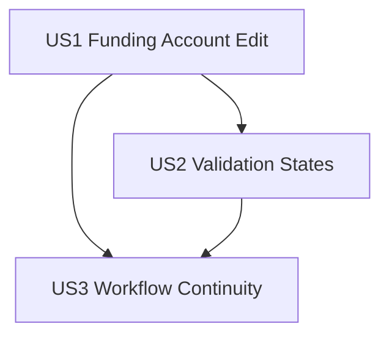

---

description: "Task list for Bill Pay funding account selector implementation"
---

# Tasks: Bill Pay Funding Account Selector

**Input**: Design documents from `/specs/001-bill-pay-funding-account/`  
**Prerequisites**: `plan.md` (required), `spec.md` (required)  
**Optional docs detected**: none (`data-model.md`, `contracts/`, `research.md`, `quickstart.md` not present)

**Tests**: Test tasks are included and MUST fail before corresponding implementation tasks, per Constitution Principle I.

**Organization**: Tasks are grouped by user story so each story can be implemented and validated independently.

## Constitution Hooks *(do not remove)*

- Every task references the spec ID and scenario it satisfies (Principle I).
- Database tasks cite migration/fixture files and deterministic behavior (Principle II).
- Dependency policy remains no-new-dependency per plan (Principle III).
- UI tasks include Tailwind watcher confirmation and HTMX target/swap safety (Principle IV).
- AI-generated work is logged in `docs/ai/005-bill-pay-funding-account-log.md` (Principle V).

## Phase 1: Setup (Shared Infrastructure)

**Purpose**: Capture implementation evidence and environment prerequisites.

- [X] T001 Confirm watcher output for `npm run dev:css` and record the session in docs/ai/005-bill-pay-funding-account-log.md
- [X] T002 Create AI implementation log scaffold with links to specs/001-bill-pay-funding-account/spec.md and specs/001-bill-pay-funding-account/plan.md in docs/ai/005-bill-pay-funding-account-log.md
- [X] T003 Document row-level HTMX target/swap invariants (`#bill-pay-row-<account_id>`, `outerHTML`) in docs/ai/005-bill-pay-funding-account-log.md

---

## Phase 2: Foundational (Blocking Prerequisites)

**Purpose**: Add shared persistence and form/service foundations required by all user stories.

**⚠️ CRITICAL**: No user story work begins until this phase is complete.

- [X] T004 Add `funding_account` foreign key and model validation updates to `MonthlyBillPayment` in financial/models.py
- [X] T005 Create deterministic migration for `MonthlyBillPayment.funding_account` in financial/migrations/0005_monthly_bill_payment_funding_account.py
- [X] T006 [P] Update bill pay fixture coverage for active and closed accounts with saved funding selection in financial/fixtures/accounts_minimal.json
- [X] T007 Extend bill pay row/query helpers for funding-account option sets and selected-value metadata in financial/services/bill_pay.py
- [X] T008 Implement active-only funding-account selector field and closed-selection fallback handling in financial/forms.py
- [X] T009 [P] Add deterministic household-scoped ordering for funding-account selector options in financial/services/bill_pay.py
- [X] T010 Update bill pay row edit/display context assembly for new funding-account data and enforce household/user authorization checks for row GET/POST in financial/views.py

**Checkpoint**: Foundation ready; user stories can proceed.

---

## Phase 3: User Story 1 - Edit Bill Row With Funding Account (Priority: P1) 🎯 MVP

**Goal**: Users can select a funding account while editing a bill row and save it with amount and paid state.

**Independent Test**: Edit one bill row, choose a funding account, enter amount, mark paid, save, and reload month view to confirm persisted selection and values.

### Tests for User Story 1 (write first; must fail before implementation)

- [X] T029 [P] [US1] Add edit-row rendering test for funding-account selector visibility and bound selected value in financial/tests/test_bill_pay_save.py
- [X] T030 [P] [US1] Add save-and-reload persistence test for funding account + amount + paid fields in financial/tests/test_bill_pay_save.py

### Implementation for User Story 1

- [X] T011 [US1] Render funding-account dropdown in bill-pay edit row with form binding in financial/templates/financial/bill_pay/_row_edit.html
- [X] T012 [US1] Persist funding account together with amount and paid fields in row-save POST flow in financial/views.py
- [X] T013 [US1] Update monthly payment upsert path to include funding-account persistence in financial/services/bill_pay.py
- [X] T014 [US1] Pre-populate edit mode with previously saved funding-account selection using bound instance data in financial/views.py
- [X] T015 [P] [US1] Show saved funding-account value in non-edit row display for post-save confirmation in financial/templates/financial/bill_pay/_row.html
- [X] T016 [US1] Ensure row save response re-renders selected funding account on successful save in financial/views.py

**Checkpoint**: US1 is fully functional and independently testable.

---

## Phase 4: User Story 2 - Prevent Invalid Save States (Priority: P2)

**Goal**: Saving without a valid funding-account selection is blocked with row-level feedback while user-entered values remain.

**Independent Test**: Attempt to save an edited row without selecting a funding account; verify save rejection, error message, and retained amount/paid input values.

### Tests for User Story 2 (write first; must fail before implementation)

- [X] T031 [P] [US2] Add validation test for missing funding account returning row-level error with preserved submitted values in financial/tests/test_bill_pay_validation.py
- [X] T032 [P] [US2] Add authorization boundary test for out-of-household row edit/save behavior in financial/tests/test_bill_pay_months.py

### Implementation for User Story 2

- [X] T017 [US2] Enforce required funding-account selection in `BillPayRowForm` validation in financial/forms.py
- [X] T018 [US2] Return edit-row fragment with validation status on missing funding account and safe unauthorized/missing responses in financial/views.py
- [X] T019 [P] [US2] Render funding-account field errors inline and preserve submitted values in financial/templates/financial/bill_pay/_row_edit.html
- [X] T020 [US2] Prevent closed accounts from appearing as selectable new options while allowing historical closed selection display in financial/forms.py
- [X] T021 [P] [US2] Handle no-available-funding-accounts empty-state message in row edit UX in financial/templates/financial/bill_pay/_row_edit.html

**Checkpoint**: US2 is fully functional and independently testable.

---

## Phase 5: User Story 3 - Keep Existing Row Edit Workflow (Priority: P3)

**Goal**: Existing row edit/save behavior remains stable with the added dropdown and no transaction side effects.

**Independent Test**: Edit and save multiple rows in sequence and confirm row-level HTMX flow remains unchanged, last successful save wins, and no transactions are created/updated.

### Tests for User Story 3 (write first; must fail before implementation)

- [X] T033 [P] [US3] Add last-write-wins concurrency-oriented save test for same account-month row in financial/tests/test_bill_pay_save.py
- [X] T034 [P] [US3] Add regression test asserting row save does not create or modify `Transaction` records in financial/tests/test_bill_pay_save.py

### Implementation for User Story 3

- [X] T022 [US3] Preserve existing row-level `hx-target`/`hx-swap` and explicit Save interaction with the new selector in financial/templates/financial/bill_pay/_row_edit.html
- [X] T023 [P] [US3] Keep save behavior as last-write-wins using existing update path semantics for concurrent row saves in financial/services/bill_pay.py
- [X] T024 [P] [US3] Ensure bill-pay row save path does not create or update `Transaction` records in financial/views.py
- [X] T025 [US3] Keep month-scoped row rendering behavior intact after funding-account updates in financial/services/bill_pay.py

**Checkpoint**: US3 is fully functional and independently testable.

---

## Phase 6: Polish & Cross-Cutting Concerns

**Purpose**: Final verification, documentation, and readiness evidence across stories.

- [X] T026 [P] Record migration + fixture determinism verification notes in docs/ai/005-bill-pay-funding-account-log.md
- [X] T027 [P] Record manual acceptance evidence for US1, US2, and US3 in docs/ai/005-bill-pay-funding-account-log.md
- [X] T028 [P] Document final no-new-dependency and no-transaction-side-effect confirmation in docs/ai/005-bill-pay-funding-account-log.md

---

## Dependencies & Execution Order

### Phase Dependencies

- **Phase 1 (Setup)**: Starts immediately.
- **Phase 2 (Foundational)**: Depends on Phase 1 and blocks all user stories.
- **Phase 3 (US1)**: Depends on Phase 2 completion.
- **Phase 4 (US2)**: Depends on Phase 2 and uses US1 edit/save surface.
- **Phase 5 (US3)**: Depends on Phase 2 and validates behavior continuity over US1/US2 paths.
- **Phase 6 (Polish)**: Depends on completion of selected user stories.

### User Story Dependencies

- **US1 (P1)**: Primary MVP slice; no dependency on other stories.
- **US2 (P2)**: Depends on US1 row edit workflow and foundational form plumbing.
- **US3 (P3)**: Depends on US1/US2 save path to confirm unchanged workflow and side-effect boundaries.
- **Test-first gate**: T029-T034 must be implemented and observed failing before running the corresponding story implementation tasks.

### Dependency Graph



---

## Parallel Opportunities

- **Phase 1**: `T002` and `T003` can run in parallel after `T001` starts watcher verification.
- **Phase 2**: `T006` and `T009` are parallelizable while core model/form/view tasks progress.
- **US1**: `T015` can run in parallel with `T012` after shared context (`T010`) is complete.
- **US2**: `T019` and `T021` can run in parallel after validation contract (`T017`) is defined.
- **Polish**: `T026`, `T027`, and `T028` are fully parallel.

---

## Parallel Example: User Story 1

```bash
Task: T012 [US1] Persist funding account in row-save POST in financial/views.py
Task: T015 [US1] Show saved funding account in financial/templates/financial/bill_pay/_row.html
```

## Parallel Example: User Story 2

```bash
Task: T019 [US2] Render field errors in financial/templates/financial/bill_pay/_row_edit.html
Task: T021 [US2] Handle no-options empty state in financial/templates/financial/bill_pay/_row_edit.html
```

## Parallel Example: User Story 3

```bash
Task: T023 [US3] Enforce last-write-wins semantics in financial/services/bill_pay.py
Task: T024 [US3] Confirm no transaction writes in financial/views.py
```

---

## Implementation Strategy

### MVP First (User Story 1 Only)

1. Complete Phase 1 and Phase 2.
2. Complete Phase 3 (US1).
3. Validate US1 independent test criteria.
4. Demo/deploy MVP slice.

### Incremental Delivery

1. Deliver US1 (funding-account selection and persistence).
2. Deliver US2 (validation and error-state handling).
3. Deliver US3 (workflow continuity and side-effect boundaries).
4. Complete Polish phase evidence and readiness checks.

### Parallel Team Strategy

1. Developer A: model/migration/service foundations (`T004`-`T010`).
2. Developer B: US1 row templates and save/display behavior (`T011`-`T016`).
3. Developer C: US2 validation UX and edge-state handling (`T017`-`T021`).
4. Shared: US3 and Polish verification.

---

## Notes

- `[P]` tasks indicate parallelizable work on different files/no blocking dependency.
- `[US1]`, `[US2]`, `[US3]` map tasks to user stories for independent delivery.
- All task descriptions include concrete file paths for direct execution.
- Fail-first test evidence for T029-T034 must be recorded in docs/ai/005-bill-pay-funding-account-log.md before marking corresponding implementation tasks complete.
