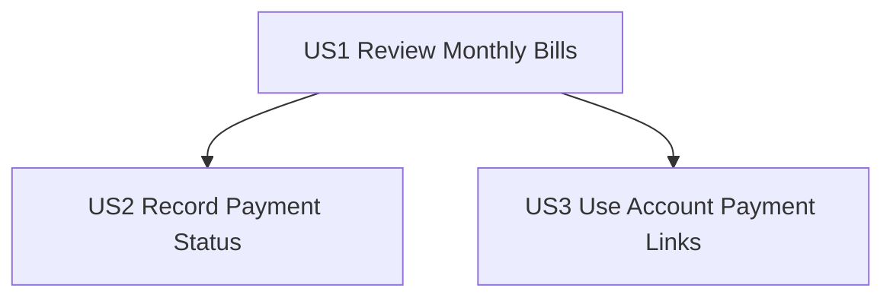

# Tasks: Bill Pay

**Input**: Design documents from `specs/001-bill-pay/`
**Prerequisites**: plan.md, spec.md, research.md, data-model.md, contracts/bill-pay.yaml, quickstart.md

## Constitution Hooks *(do not remove)*

- Every task references the spec ID and scenario it satisfies (Principle I).
- Database tasks MUST cite the migration/fixture file and describe how determinism is enforced (Principle II).
- Tasks that add a dependency must link to the plan’s approved justification; default assumption is “no new dependency” (Principle III).
- UI/tasks touching templates or CSS must include a subtask to confirm the Tailwind watcher is running and to document HTMX targets (Principle IV).
- Tasks generated or implemented with AI must store the prompt/response location noted in the task description (Principle V).

## Phase 1: Setup (Shared Infrastructure)

**Purpose**: Prepare implementation evidence and workflow prerequisites.

- [X] T001 Confirm Tailwind watcher command `npm run dev:css` and record active output in docs/ai/004-bill-pay-log.md
- [X] T002 Create Bill Pay AI log scaffold with links to spec/plan/contracts in docs/ai/004-bill-pay-log.md
- [X] T003 Verify and record HTMX target/swap map from contracts in specs/001-bill-pay/contracts/bill-pay.yaml

---

## Phase 2: Foundational (Blocking Prerequisites)

**Purpose**: Core persistence and endpoint scaffolding required before user stories.

**⚠️ CRITICAL**: No user story work begins until this phase is complete.

- [X] T004 Add `MonthlyBillPayment` model, constraints, and month normalization helpers in financial/models.py
- [X] T005 [P] Create deterministic migration for monthly bill pay schema in financial/migrations/0004_monthly_bill_payment.py
- [X] T006 [P] Add Bill Pay row/month forms and validation rules in financial/forms.py
- [X] T007 [P] Implement liability query, ordering, month parsing, and upsert helpers in financial/services/bill_pay.py
- [X] T008 [P] Add deterministic fixture data for liability accounts + monthly bill payments in financial/fixtures/accounts_minimal.json
- [X] T009 Add Bill Pay routes (`/accounts/bill-pay/`, `/table-body/`, `/{accountId}/row/`) in financial/urls.py

**Checkpoint**: Foundation complete; user stories can proceed.

---

## Phase 3: User Story 1 - Review Monthly Bills (Priority: P1) 🎯 MVP

**Goal**: User opens Bill Pay from sidebar and sees month-filtered liability rows sorted by due day.

**Independent Test**: Navigate to Bill Pay and confirm liability-only rows, due-day ordering, and month selector defaulting to current month.

### Tests for User Story 1 (write first; must fail before implementation)

- [X] T010 [P] [US1] Add index + sidebar navigation tests in financial/tests/test_bill_pay_index.py (FR-001, FR-002)
- [X] T011 [P] [US1] Add liability filtering + deterministic due-day ordering tests in financial/tests/test_bill_pay_index.py (FR-003, FR-005, SC-004)
- [X] T012 [P] [US1] Add month-selector default + historical month-view tests in financial/tests/test_bill_pay_months.py (FR-015)
- [X] T013 [US1] Add household scoping tests for Bill Pay page and month-body endpoint in financial/tests/test_bill_pay_months.py (FR-012)

### Implementation for User Story 1

- [X] T014 [US1] Implement Bill Pay index view with selected-month context in financial/views.py
- [X] T015 [P] [US1] Create Bill Pay page shell with month selector and stable table container in financial/templates/financial/bill_pay/index.html
- [X] T016 [P] [US1] Create month-swapped table body fragment in financial/templates/financial/bill_pay/_table_body.html
- [X] T017 [P] [US1] Create read-only Bill Pay row fragment with required display columns in financial/templates/financial/bill_pay/_row.html
- [X] T018 [US1] Implement table-body fragment endpoint for month switch HTMX swaps in financial/views.py
- [X] T019 [US1] Add Bill Pay navigation entry in sidebar menu in templates/components/layout/sidebar.html

**Checkpoint**: US1 is fully functional and independently testable.

---

## Phase 4: User Story 2 - Record Payment Status (Priority: P1)

**Goal**: User edits one row and explicitly saves amount/paid for the selected month.

**Independent Test**: Edit and save a row, reload same month, and confirm persisted values; invalid negative amount returns inline row errors.

### Tests for User Story 2 (write first; must fail before implementation)

- [X] T020 [P] [US2] Add row-save create/update persistence tests in financial/tests/test_bill_pay_save.py (FR-008, FR-009, FR-010)
- [X] T021 [P] [US2] Add row validation tests for `422`, negative amount rejection, and paid/amount independence in financial/tests/test_bill_pay_validation.py (FR-011, FR-016)
- [X] T022 [US2] Add regression tests requiring update endpoints to bind ModelForm with `instance=` on GET and POST in financial/tests/test_bill_pay_save.py (Constitution Principle II)

### Implementation for User Story 2

- [X] T023 [US2] Implement row-edit fragment GET endpoint for selected account-month using `ModelForm(instance=...)` in financial/views.py
- [X] T024 [P] [US2] Create editable row fragment with explicit Save control in financial/templates/financial/bill_pay/_row_edit.html
- [X] T025 [US2] Implement row-save POST endpoint using `ModelForm(instance=...)` with create/update semantics in financial/views.py
- [X] T026 [US2] Apply row validation behavior (`422` on invalid, paid independent from amount, negative blocked) in financial/forms.py
- [X] T027 [US2] Wire HTMX row targets/swaps to replace only the edited row in financial/templates/financial/bill_pay/_row.html
- [X] T028 [US2] Persist account-month updates with deterministic upsert path in financial/services/bill_pay.py

**Checkpoint**: US2 is fully functional and independently testable.

---

## Phase 5: User Story 3 - Use Account Payment Links (Priority: P2)

**Goal**: User sees online payment URL in each row with clear empty-state behavior.

**Independent Test**: Open Bill Pay for a month and verify URL rendering for rows with and without online access links.

### Tests for User Story 3 (write first; must fail before implementation)

- [X] T029 [P] [US3] Add URL-present and URL-empty rendering tests in financial/tests/test_bill_pay_index.py (FR-004)
- [X] T030 [P] [US3] Add missing/unowned row endpoint `404` behavior tests in financial/tests/test_bill_pay_months.py (contract + plan alignment)

### Implementation for User Story 3

- [X] T031 [US3] Render online access URL cell with clickable link behavior in financial/templates/financial/bill_pay/_row.html
- [X] T032 [US3] Add URL empty-state rendering and label copy for missing links in financial/templates/financial/bill_pay/_row.html
- [X] T033 [US3] Ensure URL values are prepared consistently for table and row responses in financial/services/bill_pay.py
- [X] T034 [US3] Enforce canonical missing/unowned row response status `404` in financial/views.py

**Checkpoint**: US3 is fully functional and independently testable.

---

## Phase 6: Polish & Cross-Cutting Concerns

**Purpose**: Final alignment, evidence capture, and readiness checks across stories.

- [X] T035 [P] Reconcile endpoint docs with final route/response behavior in specs/001-bill-pay/contracts/bill-pay.yaml
- [X] T036 Record fixture load determinism evidence and fixture idempotency notes in docs/ai/004-bill-pay-log.md
- [X] T037 Record migration determinism evidence (`migrate --check` and rollback notes) in docs/ai/004-bill-pay-log.md
- [X] T038 Record full failing-then-passing test evidence per story in docs/ai/004-bill-pay-log.md
- [X] T039 Validate quickstart scenario execution and record outcomes in docs/ai/004-bill-pay-log.md
- [X] T040 Record timed evidence for SC-001 and SC-002 in docs/ai/004-bill-pay-log.md
- [X] T041 Update manual test steps if implementation details changed in specs/001-bill-pay/quickstart.md
- [X] T042 Record final AI prompt/response references for PR traceability in docs/ai/004-bill-pay-log.md

---

## Dependencies & Execution Order

### Phase Dependencies

- **Phase 1 (Setup)**: no dependencies.
- **Phase 2 (Foundational)**: depends on Phase 1 and blocks all user stories.
- **Phase 3 (US1)**: depends on Phase 2.
- **Phase 4 (US2)**: depends on Phase 2 and US1 row/table shell.
- **Phase 5 (US3)**: depends on Phase 2 and US1 row rendering.
- **Phase 6 (Polish)**: depends on completion of all selected user stories.

### User Story Dependencies

- **US1 (P1)**: first deliverable MVP.
- **US2 (P1)**: depends on US1 table/row containers and foundational persistence.
- **US3 (P2)**: depends on US1 row rendering path; otherwise independent from US2.



### Within Each User Story

- Implement view/context flow before dependent template wiring.
- Keep row-level behavior isolated to row fragments and service helpers.
- Complete story checkpoint before moving to the next priority when delivering incrementally.

---

## Parallel Opportunities

- Phase 2 parallel tasks: `T005`, `T006`, `T007` (different files).
- US1 parallel tasks: `T011`, `T012` (tests) and `T015`, `T016`, `T017` (template files).
- US2 parallel tasks: `T020`, `T021` (tests) and `T024` while endpoint scaffolding (`T023`, `T025`) is in progress.
- Polish parallel tasks: `T035` and `T039` can run together.

---

## Parallel Example: User Story 1

```bash
Task: T015 [US1] Create Bill Pay page shell in financial/templates/financial/bill_pay/index.html
Task: T016 [US1] Create table body fragment in financial/templates/financial/bill_pay/_table_body.html
Task: T017 [US1] Create read-only row fragment in financial/templates/financial/bill_pay/_row.html
```

## Parallel Example: User Story 2

```bash
Task: T024 [US2] Create editable row fragment in financial/templates/financial/bill_pay/_row_edit.html
Task: T025 [US2] Implement row-save POST in financial/views.py
```

## Parallel Example: User Story 3

```bash
Task: T031 [US3] Implement URL link rendering in financial/templates/financial/bill_pay/_row.html
Task: T033 [US3] Normalize URL context in financial/services/bill_pay.py
```

---

## Implementation Strategy

### MVP First (User Story 1 Only)

1. Complete Phase 1 and Phase 2.
2. Complete US1 tasks (`T010`-`T019`).
3. Validate US1 independent test criteria.
4. Demo/deploy MVP slice.

### Incremental Delivery

1. Deliver US1 (monthly list + month selector + sidebar entry).
2. Deliver US2 (explicit row save + persistence + validation).
3. Deliver US3 (online access URL rendering behavior).
4. Finish Phase 6 polish and readiness evidence.

### Parallel Team Strategy

1. One developer handles persistence and forms (`T004`-`T007`).
2. One developer handles US1 templates/view shell (`T014`-`T019`).
3. One developer handles US2 row edit/save path (`T023`-`T028`).
4. US3 and polish work proceed after US1 foundations stabilize.
